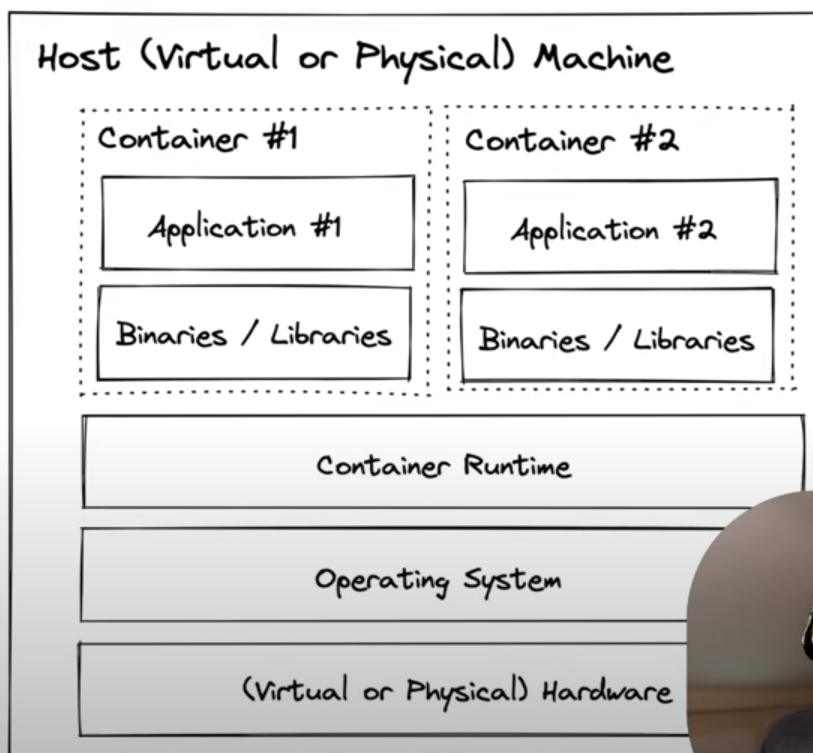
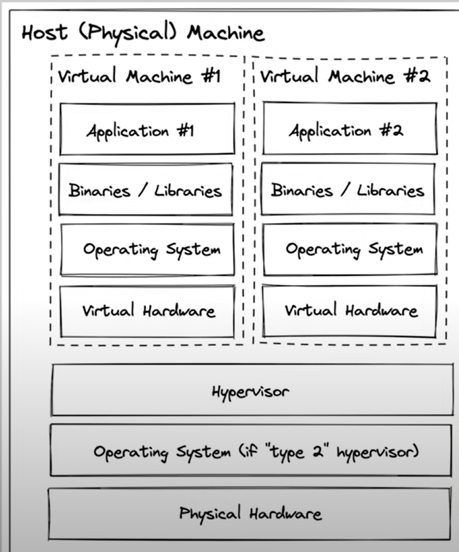
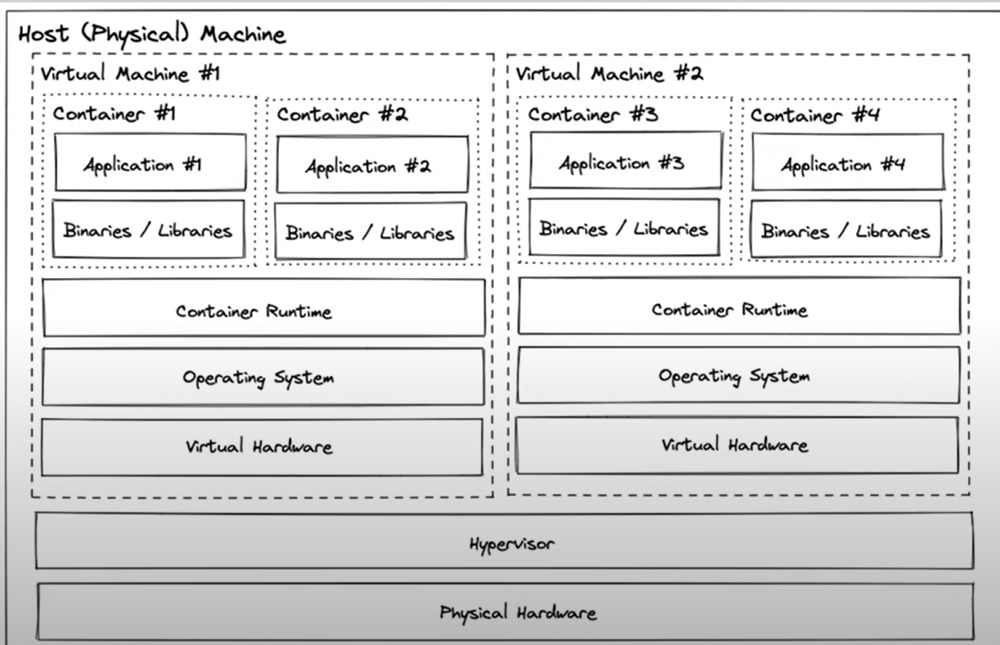
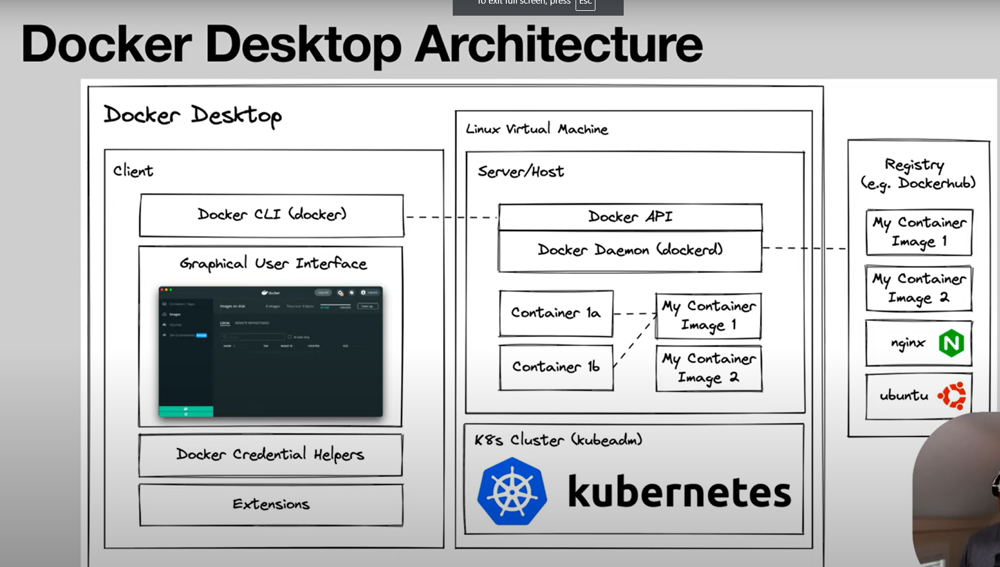

# Learning Docker

##### The repository contains important concepts, commands, notes and source code about docker. We are going to go into more details from and learn about best practices, strategies, building docker images, docker container security, development workflows and deployment strategies.

##### We are going to have an fullstack application that we will be using to learn about docker. The application is a simple application that has a frontend and a backend to showcase how to handle different languages in docker. The frontend is build on:

    - React

##### while the backend is build on

    -  Nodejs
    -  Golang (to show how different languages can be used in docker)

##### Later will be deploy to:

    - Docker Swarm (Container orchestration build into docker)
    - railway.app
    - kubernetes

[Learning source 1](https://www.youtube.com/watch?v=RqTEHSBrYFw)

#### 1.1 What problem does Docker solve?

- Docker is a tool that allows developers, sys-admins etc. to easily deploy their applications in a sandbox (called containers) to run on the host operating system i.e. The operating system installed on the physical or virtual machine where Docker is running.

- The key benefit of Docker is that it allows users to package an application with all of its dependencies into a standardized unit for software development so that the application works seamlessly in any environment without taking affect from the user's operating system, dependencies and local system configuration. Basically it solves a problem of `"it works on my machine"`.

- Docket follows Open Container Initiative (OCI) standards and is designed to work on any infrastructure.

#### 1.2 What is a docker container?

- A Docker container image is a lightweight, standalone, executable package of software that includes everything needed to run a piece of software, including the code, a runtime, libraries, environment variables, and config files so the application runs quickly and reliably from one computing environment to another.



#### 1.3 What is Virtualization?

- Virtualization is a process that allows for more efficient use of physical computer hardware and is the foundation of cloud computing. Virtualization uses software such as VMware, Oracle VirtualBox to create an abstraction layer over computer hardware, enabling the division of a single computer's hardware components—such as processors, memory and storage—into multiple virtual machines (VMs). Each VM runs its own operating system (OS) and behaves like an independent computer, even though it is running on just a portion of the actual underlying computer hardware.



#### 1.3 Can we run virtual machines and docker together?

- Yes, we can run virtual machines and docker together. Host system can install virtual machine software like VMware, Oracle VirtualBox and then install docker on the virtual machine. This way we can run multiple docker containers on the virtual machine.



- The challenge occurs within the managment of all the containers running across different virtual machines. This is where container orchestration tools like `Kubernetes` and `Docker Swarm` come in.

#### 1.4 What is the architecture of Docker Desktop when it is installed on windows and mac?

- Docker Desktop uses Hyper-V on Windows and HyperKit on Mac to run the VM. The VM runs a Linux kernel and is very lightweight. Then in that VM, docker sets up 2 softwares, one is the `Docker Demon` that exposes some APIs. so when a command is execused from the CLI. That command is passed to Docker Demon via the API.

  - `Docker Demon` is the server that runs in the background and listens for API requests and manages Docker objects like images, containers, networks and volumes etc.

- The second software that is configured and install in the VM by the Docker Desktop is the optional `kubertenes K8 cluster`. We can use this cluster to take advantage of Kubernetes if we are developing for it, without install it separately.



#### 1.4 What is the architecture of Docker Desktop when it is installed on Linux?

- `Docker Engine` is called to different components of the docker. It is the open source core.

  - Docker CLI
  - Docker APIs
  - Docker Demon

  The engine can install on any Linux distribution without the need of a VM, or a desktop client. Better to use Docker Desktop for GUI benefits.

#### 1.5 Run your first docker container:

- Run the following command in the terminal.

  ```bash
  docker run hello-world
  ```

  This will look for the hello-world image locally first, and then if it does not find it, it will pull the image from the docker hub and run the container.

#### 1.5 What is DockerHub?

- DockerHub is a cloud-based container registry service by Docker that allows developers and open source contributors to find, use, manage, and share their container images. Developers can host public repos that can be used for free, or private repos for teams and enterprises.

#### 1.6 How to persist the data change in the container?

- By Defaut, all Data created/change dinside a container is lost when the container is stopped or deleted. To presist the data, we can achieve it by 3 ways:

  1. We make sure that the data should be accurate everytime a container is up, we add the dependecy inside the container image so it should build into the image itself.
     ex: Container image as a third party database connection string that doesn't get affected when the container is stopped or deleted, probably a cloud hosted database.

  2. We can use docker **volume mount method** to store that data outside of the container filessystem. This way the data will be persisted even if the container is stopped or deleted. Docker creates a directory inside the VM that docker manages itself. The directory path in VM is `/var/lib/docker/volumes`. We can tell docker to use that volume to mount to container's directory and copy all it's data inside the container at the time of container creation. It is the default and suggested way by Docker.

  ```
  docker run -it --mount source=my-volume,destination=/app/data ubuntu:22:04
  ```

  3. We can use **Bind mount method**, by which we can bind the local directory to the container directory which is managed by our operating system and not by Docker VM.

  ```
    docker run -it --mount type=bind source="${PWD}"/local/directory destination=/app/data ubuntu:22:04
  ```

- https://www.freecodecamp.org/news/docker-mount-volume-guide-how-to-mount-a-local-directory/

### Imporatnt resources:

- https://medium.com/@HirenDhaduk1/can-you-use-containers-and-virtual-machines-together-22128a1266ff
- https://learn.microsoft.com/en-us/windows/wsl/install
- https://docs.docker.com/desktop/troubleshoot/topics/#virtualization
- https://docs.docker.com/desktop/install/windows-install/
-
